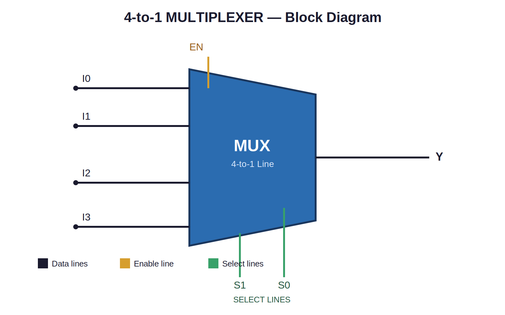
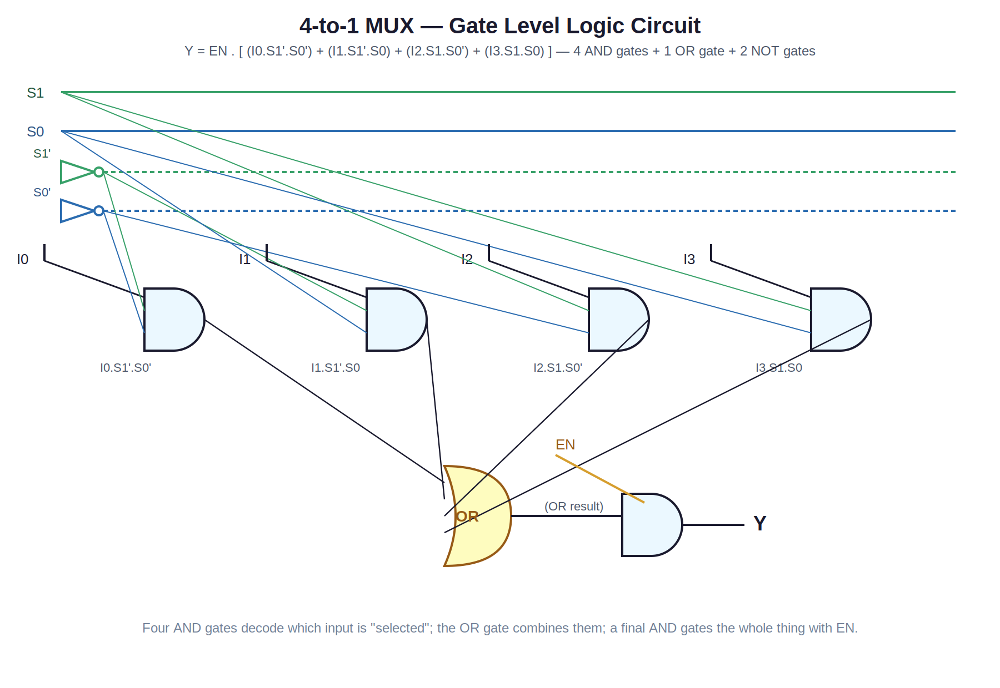
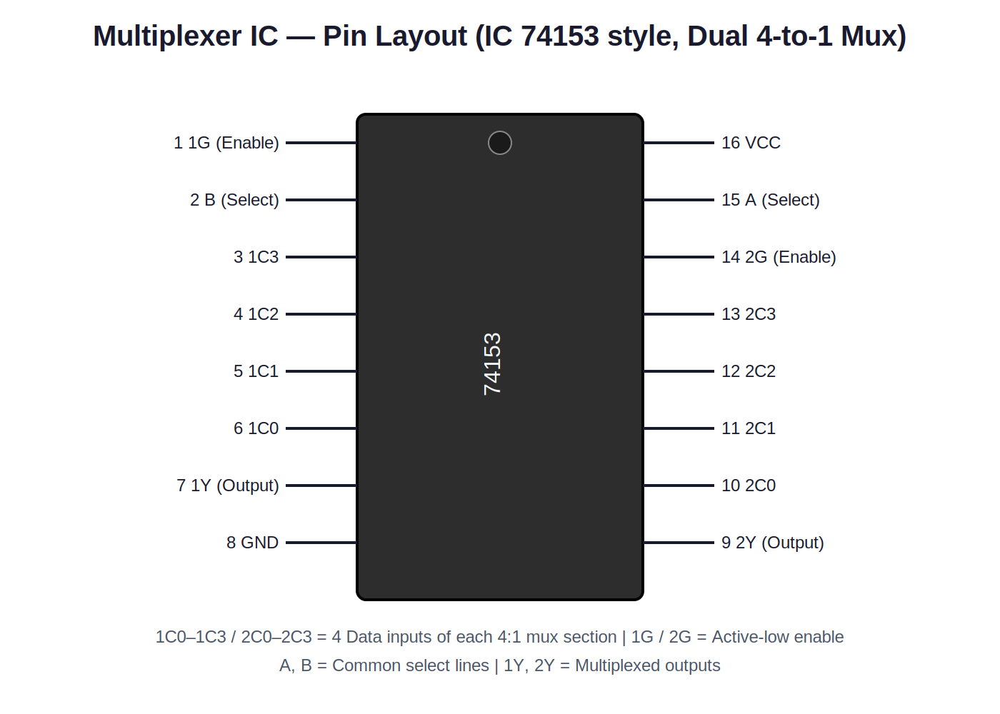

# 4-to-1 Multiplexer — DPCO Lab Project

**Course:** Digital Principles & Computer Organization (DPCO)
**Experiment Type:** Combinational Logic Circuit Design & Simulation
**Regulation:** Anna University R-2023
**Language / Tool:** Verilog HDL, simulated with Icarus Verilog (`iverilog` + `vvp`)

---

## 📌 Aim

To design, simulate, and verify the working of a **4-to-1 Line Multiplexer (MUX)** using Verilog HDL, and to understand how one of several input data lines can be selected and routed to a single output line under the control of select lines — the exact inverse operation of a Demultiplexer.

---

## 📖 What is a Multiplexer?

A **Multiplexer (MUX)** is a combinational logic circuit that selects **one of several input signals** and forwards it to a **single output line**, based on a set of **select (control) lines**. It performs data **selection / channel combining**.

- A **4-to-1 MUX** has:
  - **4 data inputs** (`I0`–`I3`)
  - **2 select lines** (`S1`, `S0`) → 2² = 4 possible combinations
  - **1 output** (`Y`)
  - **1 Enable line** (`EN`) to activate/deactivate the whole circuit

Think of a MUX as an electronic multi-position switch — it picks exactly one of many inputs and connects it to the output. It is the exact opposite of a Demultiplexer (DEMUX), which takes one input and routes it to one of many outputs.

### Block Diagram



---

## 🧮 Truth Table

| EN | S1 | S0 | Y  |
|----|----|----|----|
| 0  |  X |  X | 0  |
| 1  |  0 |  0 | I0 |
| 1  |  0 |  1 | I1 |
| 1  |  1 |  0 | I2 |
| 1  |  1 |  1 | I3 |

*(`X` = don't care; `EN=0` forces the output to 0 regardless of select lines.)*

**Boolean Expression:**
```
Y = EN . [ (I0.S1'.S0') + (I1.S1'.S0) + (I2.S1.S0') + (I3.S1.S0) ]
```

---

## 🔧 Gate-Level Logic Circuit

The circuit is built from **AND gates**, **NOT gates**, and a single **OR gate** — each AND gate "unlocks" exactly one data input when its select-line combination matches, and the OR gate combines all four into a single output line, finally gated by Enable.



---

## 🔌 Real IC Reference — 74153 (Dual 4-to-1 Line Multiplexer)

In an actual hardware lab, this experiment is commonly wired using the **IC 74153** (or 74151 for an 8-to-1 MUX). Below is the pin diagram used for the physical breadboard version of this experiment:



**Wiring on breadboard:**
1. Connect `VCC` (pin 16) to +5V and `GND` (pin 8) to ground.
2. Apply the four data signals to `1C0–1C3` (pins 6, 5, 4, 3).
3. Connect select switches to pins `A` (15) and `B` (14) — shared across both sections of the chip.
4. Tie the enable pin `1G` (pin 1) LOW (active-low enable) to activate section 1.
5. Observe output `1Y` (pin 7) using an LED — it lights up matching whichever input is currently selected.

---

## 💻 Verilog Implementation

Two implementation styles are provided so students can compare **structural (dataflow)** vs **behavioral** modeling — a common DPCO lab requirement.

### 1. Dataflow / Structural Model → [`src/mux_4to1.v`](src/mux_4to1.v)
Uses a single continuous `assign` statement built directly from the Boolean equation (AND-OR form).

### 2. Behavioral Model → [`src/mux_4to1_behavioral.v`](src/mux_4to1_behavioral.v)
Uses an `always @(*)` block with a `case` statement — closer to how you'd describe the truth table in words.

### Testbench → [`testbench/mux_4to1_tb.v`](testbench/mux_4to1_tb.v)
Applies distinct data-input patterns across every select-line combination (with enable both off and on), and prints a live truth table to the console plus a `.vcd` waveform dump for GTKWave.

---

## ▶️ How to Simulate

Using **Icarus Verilog** (free, open-source):

```bash
# Compile
iverilog -o sim/mux_sim src/mux_4to1.v testbench/mux_4to1_tb.v

# Run
vvp sim/mux_sim

# (Optional) View waveform
gtkwave mux_4to1.vcd
```

### ✅ Verified Simulation Output

```
===================================================
 EN | I0 I1 I2 I3 | SEL |  Y (expected)
===================================================
  0  |  1  0  1  0 |  00  |   0
  1  |  1  0  1  0 |  00  |   1
  1  |  1  0  1  0 |  01  |   0
  1  |  1  0  1  0 |  10  |   1
  1  |  1  0  1  0 |  11  |   0
  1  |  0  1  0  1 |  00  |   0
  1  |  0  1  0  1 |  01  |   1
  1  |  0  1  0  1 |  10  |   0
  1  |  0  1  0  1 |  11  |   1
===================================================
```
This output was generated and verified in this repository using `iverilog`, and it matches the truth table exactly — the output always equals whichever input line is currently addressed by `SEL`. Both the structural and behavioral models produce identical results.

---

## 🌍 Real-Life Applications of Multiplexers

Multiplexers are used everywhere multiple data sources need to share a single transmission line or output:

1. **Telecommunications (Time-Division Multiplexing):**
   Multiple phone calls or data streams are combined onto a single high-speed line at the transmitting end using a MUX, then split apart at the receiver using a DEMUX.

2. **Data Routing in Computer Buses:**
   A MUX allows multiple registers or memory locations to share a common data bus, selecting which source drives the bus at any given time.

3. **ALU Input Selection in CPUs:**
   Inside a processor's Arithmetic Logic Unit, multiplexers select between different operand sources or operation results before passing them to the next stage.

4. **Multiplexed Display Systems (7-Segment / LED Matrix):**
   A MUX can select which display digit's data to drive during each refresh cycle, enabling multiple digits to be time-shared over a limited number of driver lines.

5. **Communication Systems (Frequency/Time Division):**
   Satellite and telephone exchange systems use MUX circuits to combine many lower-speed channels onto one high-speed channel for transmission.

6. **Digital Signal Routing in FPGAs:**
   MUXes are core building blocks inside FPGA logic cells, used to route signals between different logic paths based on configuration bits.

7. **Testing & Debugging Circuits:**
   A MUX can select which internal test signal is routed to an output pin for observation, without needing a separate pin for every signal.

8. **Audio/Video Signal Switching:**
   Home theater systems and mixing consoles use multiplexer-based switching to select which of several input sources (HDMI ports, microphones, etc.) is sent to the output.

---

## 🧑‍🔬 Applications Summary Table

| Domain | Where MUX is Used |
|---|---|
| Telecom | Combining multiple voice/data channels onto one line |
| Computer Architecture | Bus arbitration & register selection |
| Processor Design | ALU operand/result selection |
| Display Systems | Multiplexed 7-segment / LED matrix driving |
| Communication Systems | Time/Frequency-division channel combining |
| FPGA / Digital Design | Signal routing inside logic cells |
| Testing & Debugging | Selecting internal signals for observation |
| Audio/Video Systems | Source switching (HDMI, mic, line-in selection) |

---

## 📂 Project Structure

```
DPCO_Multiplexer_Project/
├── README.md                          # This file
├── src/
│   ├── mux_4to1.v                      # Structural/dataflow Verilog model
│   └── mux_4to1_behavioral.v           # Behavioral (case-statement) model
├── testbench/
│   └── mux_4to1_tb.v                   # Testbench — verifies all input combos
├── sim/                                 # Compiled simulation binaries (generated)
├── docs/
│   └── experiment_report.md            # Full lab record write-up (aim, algorithm, result)
└── images/
    ├── block_diagram.png / .svg
    ├── logic_circuit_diagram.png / .svg
    └── ic_pin_diagram.png / .svg
```

---

## 📋 Result

The 4-to-1 Multiplexer was successfully designed, implemented in Verilog HDL (both structural and behavioral styles), and simulated. The output matched the expected theoretical truth table for all 9 tested input combinations, verifying correct functionality.

---

## 👤 Author

Prepared as part of the DPCO Laboratory coursework (Anna University, R-2023).
